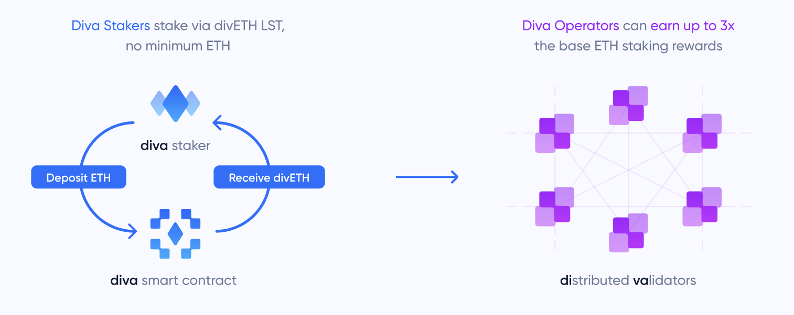
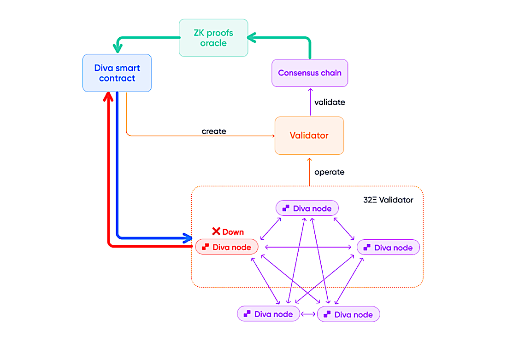

# Introduction

Diva is an Ethereum Liquid Staking protocol powered by Distributed Validator Technology (DVT). This page contains specifications of the Diva Staking protocol.

## Liquid Stakers (or "Stakers")

Liquid Stakers deposit ETH to obtain divETH which automatically accrues Ethereum staking rewards (if any). Anyone can become a Liquid Staker with no minimum ETH requirement. Stakers depositing ETH to the Diva Smart Contract will instantly receive a transferable receipt token called divETH representing their staked ETH + any staking rewards it generates.

Diva's staking is "liquid" because Stakers receive liquid divETH, meaning it is immediately transferable or tradable, as opposed to being locked. Wallets holding divETH will see their balances update daily to reflect accrued staking rewards (or penalties, if any). This is accomplished via a rebasing mechanism.

## Operators

Operators running Diva nodes can lock some divETH as collateral to secure Ethereum and generate additional divETH Operator Rewards. An Operator performing their validation duties correctly will receive divETH as Operator Rewards, in addition to divETH's own Staking Rewards.

To incentivize good behavior, an Operator misbehaving or missing their validation duties might suffer penalties on their locked divETH. Operators can only receive Key Shares once they provide enough divETH collateral to the Diva Smart Contracts.

Liquid Stakers receive Staking Rewards protected by Operator collateral. Operators receive the base Staking Rewards for their divETH collateral + Operator Rewards. The more divETH an Operator locks, the more Key Shares they may receive, increasing their ability to generate rewards.

## Distributed Validation & Architecture

## Non-custodial validation

Unlike other solutions, Operators are completely non-custodial. They never have access to the funds or private key of the validators. The Diva Smart Contract acts as a bridge, depositing ETH into the Ethereum Consensus Layer where they are used to set up validators.

Each 32Ξ Ethereum validator is operated by 16 Diva Key Shares, which are distributed to different Operators who have posted enough collateral. When a validator needs to sign its validation duties, at least 2/3rds of its Key Shares need to come to consensus on what to sign in order to perform any action.

This 66% consensus is the key to Diva's own DVT, making the system more reliable and safe. Diva Staking creates keys using Distributed Key Generation (DKG) to sign duties using “Boneh–Lynn–Shacham” BLS threshold signatures.